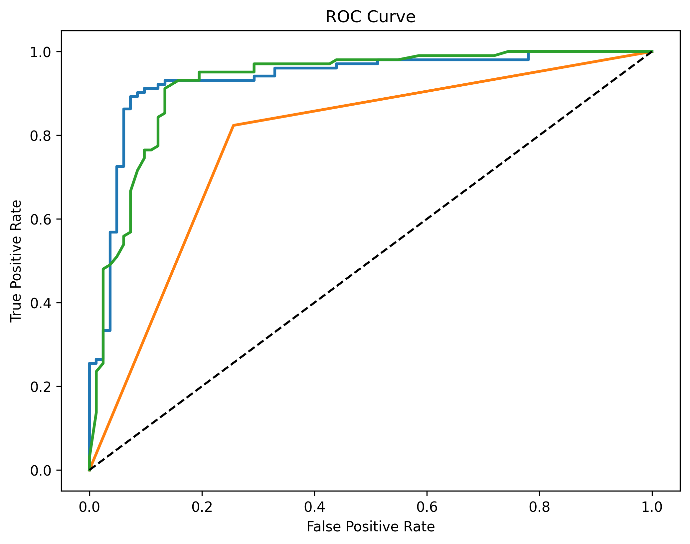
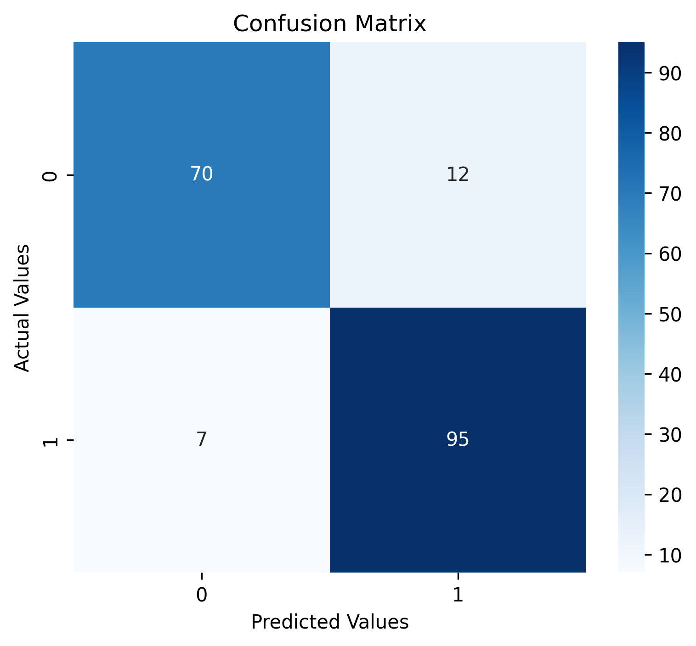
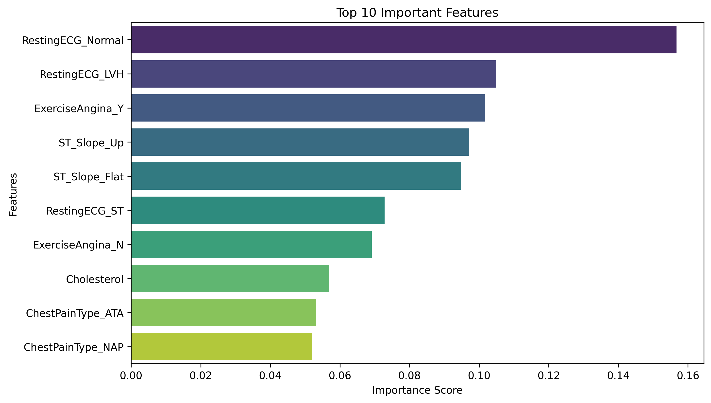
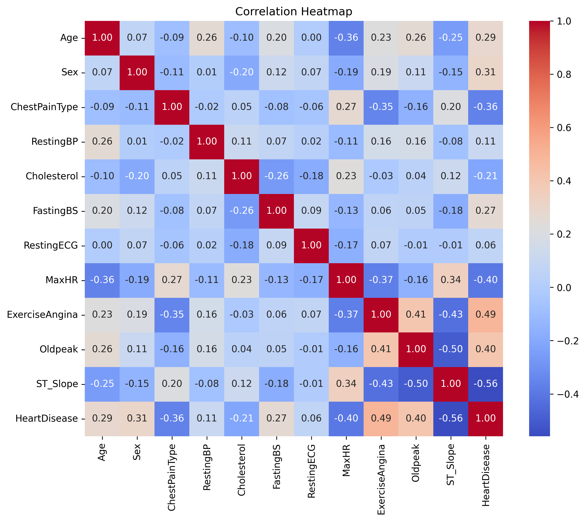
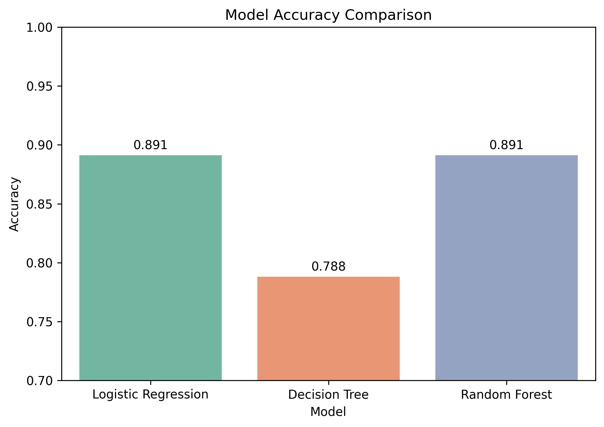

# ❤️ AI Powered Heart Disease Prediction

An end-to-end Machine Learning project that predicts the likelihood of heart disease using patient clinical data. The application is built with **Python, Scikit-learn, Streamlit**, and deployed as a web application.

---

## 📌 Project Overview

Heart disease is one of the leading causes of death worldwide. Early prediction can assist healthcare professionals in making informed decisions.

This project uses multiple Machine Learning classification algorithms to predict whether a patient is likely to have heart disease based on various medical attributes.

The complete workflow includes:

- Data Collection
- Data Cleaning
- Exploratory Data Analysis (EDA)
- Data Preprocessing
- Model Training
- Hyperparameter Tuning
- Model Evaluation
- Streamlit Web Application
- GitHub Deployment

---

## 🎯 Objectives

- Predict the presence of Heart Disease
- Compare multiple ML algorithms
- Optimize the best performing model
- Deploy an interactive prediction application

---

## 📂 Dataset

**Dataset Name**

Heart Failure Prediction Dataset

**Source**

Kaggle

https://www.kaggle.com/datasets/fedesoriano/heart-failure-prediction

### Dataset Information

- Total Records : 918
- Features : 11
- Target Variable : HeartDisease

---

## 📊 Features Used

| Feature | Description |
|----------|-------------|
| Age | Patient Age |
| Sex | Gender |
| ChestPainType | Chest Pain Type |
| RestingBP | Resting Blood Pressure |
| Cholesterol | Serum Cholesterol |
| FastingBS | Fasting Blood Sugar |
| RestingECG | Resting ECG Results |
| MaxHR | Maximum Heart Rate |
| ExerciseAngina | Exercise Induced Angina |
| Oldpeak | ST Depression |
| ST_Slope | ST Segment Slope |

Target:

HeartDisease

---

## 🛠 Technologies Used

- Python
- NumPy
- Pandas
- Matplotlib
- Seaborn
- Scikit-learn
- Streamlit
- Joblib

---

# Project Workflow

## 1. Data Cleaning

- Checked missing values
- Artificially introduced missing values for demonstration
- Handled missing values using

  - Mean
  - Median
  - Mode

- Duplicate checking
- Outlier Detection using IQR

---

## 2. Exploratory Data Analysis

Performed various visualizations including:

- Target Distribution
- Age Distribution
- Cholesterol Distribution
- Gender Distribution
- Chest Pain Analysis
- Correlation Heatmap
- Scatter Plot
- Boxplots
- Feature Relationships

---

## 3. Data Preprocessing

- Numerical & Categorical feature separation
- StandardScaler
- OneHotEncoder
- ColumnTransformer
- Train-Test Split

---

## 4. Machine Learning Models

Three Classification Algorithms were trained.

- Logistic Regression
- Decision Tree Classifier
- Random Forest Classifier

---

## 5. Model Evaluation

Evaluation Metrics

- Accuracy
- Precision
- Recall
- F1 Score
- Confusion Matrix
- Classification Report
- ROC-AUC Score
- ROC Curve

---

## 6. Hyperparameter Tuning

Random Forest was optimized using

RandomizedSearchCV

Optimized Parameters

- n_estimators
- max_depth
- min_samples_split
- min_samples_leaf
- max_features
- bootstrap

---

## 📈 Final Model Performance

| Metric | Score |
|---------|--------|
| Accuracy | 89.67% |
| Precision | 88.79% |
| Recall | 93.14% |
| F1 Score | 90.90% |
| ROC-AUC | 93.29% |

---

## 📸 Project Screenshots

### ROC Curve



---

### Confusion Matrix



---

### Feature Importance



---

### Correlation Heatmap



---

### Model Comparison



---

## 🚀 Running the Project

### Clone Repository

```bash
git clone https://github.com/yourusername/Heart-Disease-Prediction.git
```

### Navigate to Project

```bash
cd Heart-Disease-Prediction
```

### Install Requirements

```bash
pip install -r requirements.txt
```

### Run Streamlit

```bash
streamlit run app.py
```

---

## 📁 Project Structure

```
Heart-Disease-Prediction/
│
├── app.py
├── README.md
├── requirements.txt
├── models/
├── notebook/
├── dataset/
├── images/
```

---

## 🔮 Future Improvements

- Deep Learning Models
- XGBoost & LightGBM
- Explainable AI (SHAP)
- Docker Deployment
- Cloud Deployment
- Real-time Hospital Integration

---

## 👨‍💻 Author

**Saarnab Bishayee**

B.Tech Computer Science Engineering

KIIT University

Summer Training Project (2026)

---

## ⭐ Acknowledgements

- Kaggle
- Scikit-learn Documentation
- Streamlit Documentation
- Python Community
